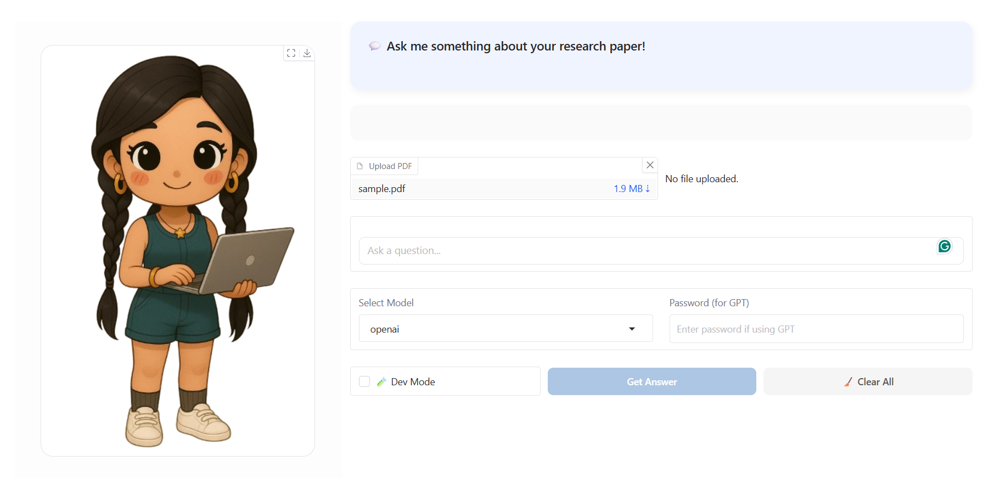

# 🧠 ChibiRan: Your Mini AI Assistant

## RAG-based QA for Scientific PDFs

> **Version 1.0** 

This is a modular **Retrieval-Augmented Generation (RAG)** assistant built with **LangChain**, **FAISS/Chroma**, and **OpenAI/Hugging Face** LLMs.

Upload a research PDF, ask natural questions, and get intelligent answers — powered by vector embeddings, semantic search, and LLMs.

---

## 🚀 Live App

[](https://huggingface.co/spaces/GazalRan/ChibiRan)

---

## 📸 Screenshot



---

## 🔧 Key Features

- 📄 Upload and parse any scientific PDF
- 🧠 Question-answering powered by `gpt-4`, Mistral, or your own model
- ✂️ Automatic chunking and embedding with LangChain
- 🔍 Search via **FAISS** (default) or **ChromaDB**
- 🎯 Two-layer QA: strict context-only answers + fallback summarization
- 💾 Caches vectorstores — avoids re-embedding
- 🔐 GPT password-lock for usage control (e.g., token cost management)
- 🧪 Dev mode for cost-free testing
- 🌐 Gradio interface for local or cloud deployment

---

## 💼 Tech Stack / Skills

- **Python**, **LangChain**, **LLMs**, **RAG**
- OpenAI API, Hugging Face Hub models
- FAISS, ChromaDB, PyPDFLoader
- Gradio UI, `.env` & Hugging Face secrets
- Ready for local or cloud (Hugging Face Spaces, Streamlit)

---

## 📁 Project Structure

```
rag-ai-assistant/
├── app_local.py           # Gradio app (local)
├── app_hg.py              # Gradio app (Hugging Face Deployment)
├── main.py                # Optional CLI runner
├── config.py              # Central config (model, chunk size, secrets)
├── loader.py              # Vectorstore loading (FAISS or Chroma)
├── llm_provider.py        # Dynamically load OpenAI or Hugging Face LLMs
├── utils.py               # Prompting logic + fallback handling
├── documents/             # Upload PDFs here
├── faiss_dbs/             # FAISS vectorstore cache
├── chroma_dbs/            # Chroma vectorstore cache
└── static/                # Avatar, screenshots
```

---

## 🛠️ Setup Instructions

### 1. Clone and Create Environment

```bash
git clone https://github.com/ghazalehran/rag-ai-assistant.git
cd rag-ai-assistant
python -m venv rag-env
source rag-env/bin/activate  # Windows: rag-env\Scripts\activate
pip install -r requirements.txt
```

### 2. Add Secrets Locally

Create a `.env` file:

```
OPENAI_API_KEY=sk-...
HUGGINGFACEHUB_API_TOKEN=hf-...
GPT_ACCESS_PASSWORD=your-password
```

> For Hugging Face Spaces or Streamlit: use **secret management UI** instead.

---

## 🖥 Run the App Locally

```bash
python app_local.py
```

Then visit `http://localhost:7860` in your browser.

---

## ⚙️ Configuration Options

All in `config.py`:

| Key                  | Description                          |
|----------------------|--------------------------------------|
| `LLM_BACKEND`        | `"openai"` / `"huggingface"`         |
| `VECTORSTORE_BACKEND`| `"faiss"` / `"chroma"`               |
| `TEMPERATURE`        | Controls LLM creativity              |
| `USE_HF_SECRETS`     | Use `.env` (False) or cloud secrets  |
| `OPENAI_MODEL`       | Default: `"gpt-4"`                   |
| `HF_MODEL`           | Mistral, Falcon, etc.                |

---

## ✅ Models Used

- **OpenAI**: `gpt-4`, `gpt-3.5-turbo`
- **Hugging Face**: [`mistralai/Mistral-7B-Instruct-v0.2`](https://huggingface.co/mistralai/Mistral-7B-Instruct-v0.2)

---

## 📦 What's Next (v2 Goals)

- 🔍 Add citation tracing / confidence scoring
- 🧠 Add local LLM support (e.g., llama.cpp)
- 📚 Multi-document retrieval
- 📈 Improve prompt tuning & factuality checks

---

## 📄 License

MIT License — free to use and build upon.

---

## 🙋‍♀️ Let’s Connect!

- 💼 [LinkedIn](https://linkedin.com)
- 💻 Open an issue or contribute!

---

_This app was built as part of my AI/NLP portfolio to showcase modern RAG pipelines and research-focused use cases._
